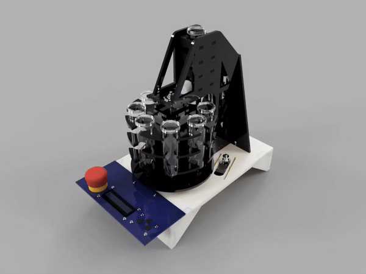

# Thomas Butler's University of Liverpool Final Year Project
## Autosampler
 This repository holds the design files and source code for Thomas Butler's UOL Final Year Project.

 

### Arduino firmware
The firmware for this project is [Autosampler_firmware.ino](Arduino/Autosampler_firmware/Autosampler_firmware.ino).
To install, place the contents of the [Arduino](Arduino) folder in your Arduino IDE's sketchbook location.

### GUI software
The source files for the Qt creator project are in the [GUI](GUI) folder.

### CAD files
You can get the Fusion 360 assembly file [here](https://a360.co/32DXsge).

### PCB files
The Eagle CAD files and Gerber outputs for the main PCB can be found in the [PCB](PCB) folder.